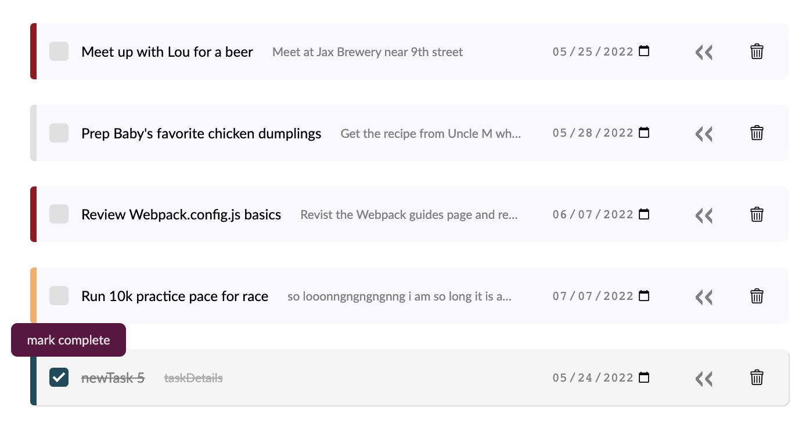

# toDo-lists

A simple [toDo List App](https://github.com/dwgrossberg/todo-list) built using vanilla JavaScript, CSS, and Webpack.

---

## Key Features :

- Simple to use: add a task or a project with only one-click
  
  

- Fully customisable task cards allow users to easily modify each task's title, details, dueDate, priority, and completion status
  
  

- Task cards automatically sort by dueDate

- Completed tasks are moved to the bottom of their respective list for visual clarity, regardless of dueDate
  

- Filter tasks by dueDate or project name, or search for tasks directly in the searchbar
  

- An undo button that restores deleted tasks and projects
  

- Keeps track of each user's tasks and projects with `localStorage`
  

---

## Learning Outcomes :

- Put OO SOLID design principles into action, in particular ensuring that modules adhere to the single responsibility principle
- Developed a module to get and set `localStorage` Task and Project objects using JSON
- Strengthened understanding of working with ES6 modules and Webpack
- Utilized module design patterns and factory functions to minimize the amount of global code within the overall program
- Implemented ESLint and Prettier into the build environment

---

Built as part of the open-source [Odin Project](https://www.theodinproject.com/) curriculum

Icon image credit: flaticon
